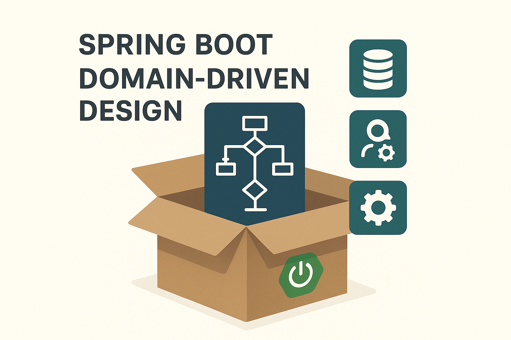

<p align="center">
    <a href="" target="_blank">
      
    </a>
</p>
<h1 align="center">Kai-Frame-DDD</h1>
<p align="center"><strong>领域驱动设计DDD的SpringBoot脚手架<br><em>持续更新中～</em></strong></p>
<div align="center">
    <a href="https://github.com/AlfonsoKevin/Kai-Frame-DDD"></a></div>


---


## 介绍

---

基于SpringBoot的**领域驱动设计DDD快速开发脚手架**（[Maven Archetype](https://maven.apache.org/archetype/maven-archetype-plugin/generate-mojo.html)），旨在帮助开发者以业务领域为核心，构建高内聚、低耦合的应用架构。

- 采用分层与分域相结合的DDD架构模式（Domain、Application、Infrastructure、Interface）
- 内置通用领域基础组件，支持聚合根、领域事件、仓储等机制
- 统一规范模块结构，支持Maven多模块化管理
- 聚焦领域建模与业务逻辑，实现代码与业务语义的强绑定
- 提供基础依赖与模板示例，助力团队快速上手领域驱动开发

| Dependencies | Version |
| ------------ | ------- |
| SpringBoot   | 3.2.0   |
| JDK          | 17      |
| ...          | ...     |

## 目录结构&设计🚀

---

结构树：

```txt
├─📁 docs                                    # 相关文档
│ └─📁 dev-ops
│   ├─📁 mysql                               # .sql文件
│   └─📁 redis
├─📁 kai-frame-api                           # rpc，远程调用相关
├─📁 kai-frame-app                           # 应用层，启动项目
├─📁 kai-frame-domain                        # 领域层，DDD核心
│ ├─📄 pom.xml
│ └─📁 src
│   └─📁 main
│     └─📁 java
│       └─📁 io
│         └─📁 github
│           └─📁 alfonsokevin
│             └─📁 domain
│               └─📁 xxx
│                 ├─📁 event                 # 事件，消息
│                 ├─📁 model                 # 聚合，实体，值对象
│                 ├─📁 repository            # 仓储接口
│                 └─📁 service               # 服务，和服务实现
├─📁 kai-frame-infrastructure                # 基础层
│ ├─📄 pom.xml
│ └─📁 src
│   └─📁 main
│     └─📁 java
│       └─📁 io
│         └─📁 github
│           └─📁 alfonsokevin
│             └─📁 infrastructure
│               ├─📁 event                   # MQ消息发送，供
│               ├─📁 gateway                 # 网关
│               └─📁 persistent              # 仓储层实现
│                 ├─📁 dao                   # mapper接口和持久化对象
│                 ├─📁 elasticsearch         # es相关
│                 ├─📁 redis                 # redis相关
│                 └─📁 utils                 # 工具类
├─📁 kai-frame-trigger
│ ├─📄 pom.xml
│ └─📁 src
│   └─📁 main
│     └─📁 java
│       └─📁 io
│         └─📁 github
│           └─📁 alfonsokevin
│             └─📁 trigger
│               ├─📁 http                    # Controller接口
│               ├─📁 job                     # 定时任务
│               └─📁 listener                # 消息消费者/事件驱动
└─📁 kai-frame-types
  ├─📄 pom.xml
  └─📁 src
    └─📁 main
      └─📁 java
        └─📁 io
          └─📁 github
            └─📁 alfonsokevin
              └─📁 types
                ├─📁 annotations             # 自定义注解
                ├─📁 common                  # 通用包
                ├─📁 enums                   # 自定义常用枚举
                ├─📁 event                   # 基础事件/消息模板
                ├─📁 exception               # 异常处理
                └─📁 utils                   # 通用工具包
```

### 详细介绍

> 先决条件：
>
> 1.一定要有Maven, 本地配置正常并且在**3.0**以上
>
> 2.如果您项目中没有接触过DDD，建议您在使用DDD脚手架开发之前，最好先了解：
>
> Ⅰ.什么是领域驱动设计？
>
> Ⅱ.领域驱动设计的结构是什么？
>
> Ⅲ.MVC和DDD的区别？

####  使用说明

##### 1.指定坐标信息创建⭐

使用Maven Cental的坐标进行创建，在想要创建的项目路径下，直接使用mvn命令如下

```java
mvn archetype:generate "-DgroupId=io.github.alfonsokevin" "-DartifactId=kai-ddd" "-Dversion=1.0.0 -Dpackage=io.github.alfonsokevin" "-DserverPort=8081" "-DarchetypeGroupId=io.github.alfonsokevin" "-DarchetypeArtifactId=kai-frame-ddd-archetype" "-DarchetypeVersion=1.0.0" "-DprofilesActive=dev" "-DinteractiveMode=false"
```

格式化后：

```java
mvn archetype:generate
 -DgroupId=io.github.alfonsokevin
 -DartifactId=kai-ddd
 -Dversion=1.0.0
 -Dpackage=io.github.alfonsokevin
 -DserverPort=8081
 -DprofilesActive=dev
 -DarchetypeGroupId=io.github.alfonsokevin
 -DarchetypeArtifactId=kai-frame-ddd-archetype
 -DarchetypeVersion=1.0.0
 -DinteractiveMode=false
```

参数解读：

| 参数                  | 解释                                 | 是否可自定义 | 默认值                  |
| --------------------- | ------------------------------------ | ------------ | ----------------------- |
| -DgroupId             | 你想要生成项目的groupId              | Y            | 交互输入/命令行提前输入 |
| -DartifactId          | 你想要生成项目的artifactId（项目名） | Y            | 交互输入/命令行提前输入 |
| -Dversion             | 你想要生成项目的version              | Y            | 交互输入/命令行提前输入 |
| -Dpackage             | 你想要生成项目的包名                 | Y            | 交互输入/命令行提前输入 |
| -DserverPort          | 默认项目端口号                       | Y            | 8081                    |
| -DprofilesActive      | 运行环境                             | Y            | dev                     |
| -DinteractiveMode     | 交互式创建                           | Y            | true                    |
| -DarchetypeGroupId    | 使用到的模板的groupId                | N            | io.github.alfonsokevin  |
| -DarchetypeArtifactId | 使用到的模板的artifactId             | N            | kai-frame-ddd-archetype |
| -DarchetypeVersion    | 使用到的模板的version                | N            | 1.0.0                   |


##### 2.本地保存文件创建

将以下内容添加到本地仓库`~/.m2/repository`中(一般是在C:Users下)的`archetype-catalog.xml`文件中

```xml
    <archetype>
      <groupId>io.github.alfonsokevin</groupId>
      <artifactId>kai-frame-ddd-archetype</artifactId>
      <version>1.0.0</version>
      <description>Parent pom providing dependency and plugin management for applications built with Maven</description>
    </archetype>
```

使用方式：

1.交互式生成：

在想要创建项目的文件夹下，进入命令行窗口

```java
mvn archetype:generate -DarchetypeCatalog=local
```

输入对应需要的参数

2.命令一键生成（同指定坐标信息创建)

```java
mvn archetype:generate "-DgroupId=io.github.alfonsokevin" "-DartifactId=kai-ddd" "-Dversion=1.0.0 -Dpackage=io.github.alfonsokevin" "-DserverPort=8081" "-DarchetypeGroupId=io.github.alfonsokevin" "-DarchetypeArtifactId=kai-frame-ddd-archetype" "-DarchetypeVersion=1.0.0" "-DprofilesActive=dev" "-DinteractiveMode=false"
```


### 注意事项

- 本项目仅供学习和参考使用，未经授权请勿用于商业目的。
- 欢迎贡献代码或者提出建议，您可以通过提出 Issue 或者 Pull Request 的方式参与到项目中来。

## 参与贡献

如果您对项目有任何建议或想要贡献代码，欢迎提交 Issue 或 Pull Request。我们期待您的参与，共同完善和改进项目！

---

感谢您对该项目的关注和支持！🕵️‍♀️
